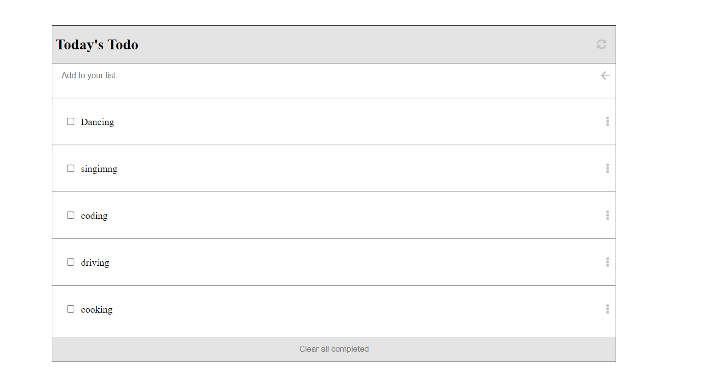

# Webpack

# Todo-list

> Todo-list project: Todo is a tool which organize daily activites, and gives you a list where you can mark completed tasks.

Additional description about the project and its features.

## Built With

- HTML, CSS
- webpack 
- Javascript

## Getting Started
To get a local copy up and running follow these simple example steps.

- STEP 1

1. Enter this url: https://github.com/Mithi-code/webpack-todo in your web browser.
2. Once opened navigate to the top left level of the project a green code download button will be visible on the righthand side.
3. click on the green button with name "Code", Select download Zip option from drop down menu.
4. Once the download is extract the zip file into any folder of your choice on your system.
5. you will be able to access my project locally.

- STEP 2

Open command prompt
1. go to the designated folder where you want to clone the repository to.
2. enter git clone https://github.com/Mithi-code/webpack-todo
3. open your designated folder.
4. you will be able to access my project locally.

### Prerequisites
live server vscode extention
### Setup
Open with live server on vscode
### Install
no installations

## LIVE DEMO
[View Live Demo]()

## Authors

👤 **Author**

- GitHub: [@githubhandle](https://github.com/Mithi-code)
- Twitter: [@twitterhandle](https://twitter.com/LazyMithlesh)
- LinkedIn: [LinkedIn](https://www.linkedin.com/in/mithlesh-kumar-564a97221/)

## 🤝 Contributing

Contributions, issues, and feature requests are welcome!

Feel free to check the [issues page](https://github.com/Mithi-code/webpack-todo/issues).

## Show your support

Give a ⭐️ if you like this project!

## Acknowledgments

- Hat tip to anyone whose code was used
- Inspiration
- etc

## 📝 License

This project is [MIT](./MIT.md) licensed.
